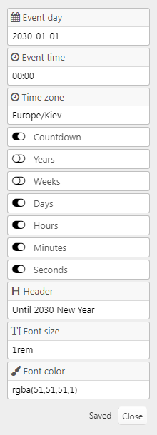

# [mh Countdown](https://github.com/mahotilo/CS.mh_Countdown) - Cashed external image. 
## Section type for CustomSections plugin (Typesetter CMS)

## About
Flip Countdown Timer section
Wrapper for Simple countdown https://github.com/Dazix/SimpleCountDown

## See also 
* [CustomSections](https://github.com/juek/CustomSections)
* [Typesetter on GitHub](https://github.com/Typesetter/Typesetter)
* [Typesetter Home](http://www.typesettercms.com)

## Requirements
* Typesetter CMS
* CustomSections addon installed.

## Manual Installation
1. Download the [master ZIP archive](https://github.com/mahotilo/CS.mh_Countdown/archive/master.zip)
2. Upload the extracted folder '_types' to your server into the /addons/CustomSections-master/_types directory

## Demo
### Timer

### Settings

## License
GPL 2, for bundled thirdparty components see the respective subdirectories.

## Version history
* v1.0 
	- initial release
